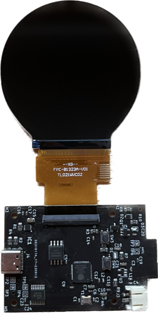

# Bitcoin Metrics Tracker

# Introduction

The Bitcoin metrics tracker was designed to sit near your desktop and keep an eye on several key important metrics on the Bitcoin network. These metrics include the Bitcoin price, the total Bitcoin marketcap, the total Bitcoin supply, the hash rate of the network, the current number of Bitcoins rewarded per block, the estimated time interval between blocks mined, the number of blocks mined so far and the remaining blocks left to mine in the current 4 year cycle. It uses Wi-Fi to connect to Blockchain.com to update the metrics at regular intervals. There is no need to hard code Wi-Fi credentials as there is a WPS setup for synchronisation with your router. Router credentials are then saved to flash memory via NVS so that you only have to do it one time. The green light on the screen indicates if Wi-Fi is connected. The green light will switch off if disconnected with the router. It will try to reconnect when it disconnects. The spinner around the green light is when the data is updating. 

# Parts Included

For the 3D printed case I have included the 3mf files. This project includes the following,

- RGB (565) display with ST7701s IC driver,
- ESP32-S3 R8 (8MB PSRAM) and 4MB of flash memory,
- Charging circuitry on PCB,
- USB-C,
- 3D print case

# Development Board

# Software 

- Kicad for PCB files,
- Fusion 360 for STL files,
- ESP-IDF for development environment,
- SquareLine Studio for display graphics

# Pinout

You can find the entire pinout with the schematic provided. But a brief overview is as follows,

Buttons

- TP6 to TP7 for Power button,
- SW3 - Reset button,
- SW4 - Boot button

# WPS

When you first turn on the device you will be met with the WPS screen. This is so you can connect to your router without needing to type your Wi-Fi credentials. So you need to press your WPS button on your router to sync it with the device. If it fails to move on from the WPS screen, unplug the device and plug it back in and press the WPS button on the router again. If it syncs with your router it will move on to the next screen which is a Bitcoin logo saying setup. 

# Programming the device

There are two modes for the ESP32-S3, download mode (upload program) and run mode (code running). To put the board in program mode press and hold the button SW4 (boot) and while this is still being held press the SW3 (reset) button. To put the board into run mode just press SW3 (reset) button once or alternatively just unplug the device. 

- idf.py set-target ESP32-S3 (only need to do this once)
- idf.py build (rebuild when you make changes to code)
- idf.py flash -p COM8 -b 921600 monitor (download code while monitoring)

# Restore credentials

If you want to change the Wi-Fi credentials to a new router, I have put in a define for restoring credentials. To do this you need to uncomment the following and build+download+run this code to clear credentials. 

#define CONFIG_RESTORE

You then need to comment it out again and download it to revert to original code. 

//#define CONFIG_RESTORE

# Further Work

The device currently doesnt have a GPIO reset button which means that once you sync the device with a Wi-Fi router via WPS you cant join a different router unless you reprogram the board with the config restore feature.

